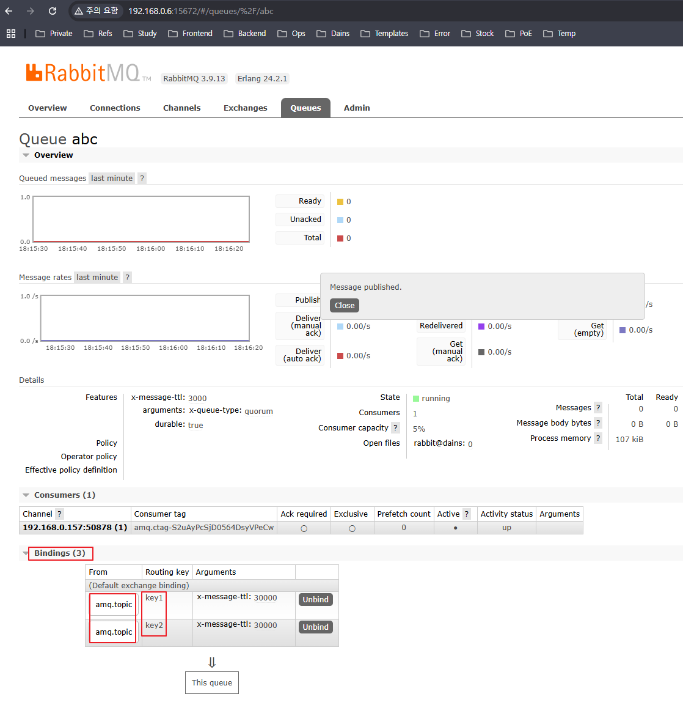
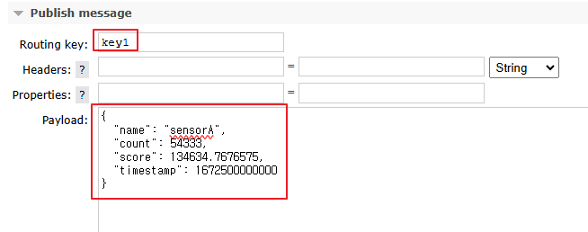

## 📚 Spring Cloud Stream + RabbitMQ Binder(시계열 데이터 집계 파이프라인 구현)

사내에서 새로운 플랫폼 개발이 시작되기 전, 기존의 데이터 처리 로직은 아래와 같았습니다.

**기존 로직**

- AI Raw Data 생성
- MQTT 프로토콜로 RabbitMQ에 만들어둔 Topic(Routing Key)기반 Quorum Queue로 데이터 적재
- Spring에서 Queue의 데이터를 Consume(`DeliverCallBack을 이용한 Basic Consume 방식`) 하여 전처리(집계 및 캐싱, 통계처리)

<br>

**구현할 로직**

- BasicConsume 방식으로 Queue에서 받던 데이터를 `StreamBridge 클래스` 로 전환해 RabbitMQ Binder를 구현한 AggregationProcessor에 바로 전달
- AggregationProcessor

간단하게 요약해서 썼지만 매번 구현할 떄마다 많은 수의 스레드와 클래스들과 로직이 필요하고 매번 다르게 설정하는것이 너무 번거로워 대체할 수 있는걸 찾아보다,

Spring CLoud Stream을 이용해 내부적으로 데이터를 집계해주는걸 찾아서 무작정 구현해 보았습니다.

실무 적용까지는 못하겠지만 나중에 거의 이걸로 마이그레이션 할것 같습니다.

<br>

> **구현 방식**

Spring Cloud Stream은 Functional 방식과 Annotated 방식 두가지가 있습니다.

Spring 3.x.x 버전을 사용한다면 Annotated 방식을 사용 못하고, 저는 3.x.x 버전을 사용중이니 Functional 방식을 사용하고, 간단한 차이점은 아래 표에 적어두었습니다.

| 비교 항목      | Functional 방식                     | Annotated 방식                     |
|--------------|--------------------------------|--------------------------------|
| **도입 시기**  | Spring Boot 2.1 이상            | 초기(Spring Boot 2.0 이하)      |
| **선언 방식**  | `@Bean` + `Function` / `Consumer` / `Supplier` | `@StreamListener` + `@EnableBinding` |
| **바인딩 설정** | `application.yml`에서 function과 바인딩 연결 | 인터페이스(`@Input`, `@Output`) 사용 |
| **유지보수성**  | 높음 (코드 간결)                 | 비교적 낮음 (인터페이스 및 어노테이션 기반) |
| **유연성**    | 높음 (여러 함수 조합 가능)         | 상대적으로 낮음                 |
| **Spring Boot 3.x 지원** | ✅ 지원                   | ❌ `@StreamListener` Deprecated |


<br>

> **참고 문서**

[Spring Cloud Stream 공식 문서](https://docs.spring.io/spring-cloud-stream-binder-rabbit/docs/current/reference/html/spring-cloud-stream-binder-rabbit.html)

application.yml에 설정한 프로퍼티들은 공식문서에서 필요할것 같은것만 빼서 사용하였습니다.

---

## 📚 RabbitMQ 설정

원래 사용하던 테스트용 Ubuntu에 구축해놓은 RabbitMQ에서 테스트로 쓸 `abc` 라는 이름의 Quorum Queue를 만들어줍니다.

그리고 1개의 큐에 각각 다른 라우팅 키를 가진 데이터가 들어올 때 그룹화를 해야 하므로, 

RabbitMQ의 Topic 기반 Exchange는 Default로 `amq.topic` Exchange로 들어오므로, 이 Exchange와 테스트로 쓸 `key1`, `key2` 2개의 라우팅키를 Quorum Queue에 바인딩 시켜줍니다.

이후 구현할 때 단순하게 큐만 Subscribe 하는것이 아니라, 다양한 라우팅 키로 들어오는 데이터들을 라우팅 키 기준으로 데이터를 그룹화 해야합니다.



---

## 📚 Settings & Bindings

**build.gradle**

필요한 의존성을 추가해 줍니다.

```groovy
    // Spring AMQP & Spring Cloud Stream * RabbitMQ Binder
    implementation 'org.springframework.boot:spring-boot-starter-amqp'
    implementation 'org.springframework.cloud:spring-cloud-starter-stream-rabbit'
    implementation 'org.springframework.cloud:spring-cloud-stream'
```

<br>

**application.yml 바인딩 설정**

설명은 주석으로 달아 놓았습니다.

공식 문서에서 많이 참고한 부분은 `spring.cloud.stream.rabbit.bindings` 쪽 옵션들입니다.

```yaml
server:
  port: 9999

spring:
  cloud:
    stream:
      bindings:
        # 'aggregateAndLog-in-0' 바인딩은 AggregationProcesser의 Consumer 함수와 연결됩니다.
        aggregateAndLog-in-0:
          # 'destination'은 제가 미리 생성해 놓은 RabbitMQ의 Quorum Queue 이름입니다.
          destination: abc
          # 'group'은 소비자 그룹 이름을 지정합니다.
          # 고정 그룹을 사용하면 여러 인스턴스 간에 메시지 분산 소비가 가능하고, 내구성이 보장됩니다.
          group: consumer
          # 'binder'는 사용할 바인더의 이름을 지정합니다.
          # 여기서는 'rabbit'이라는 이름의 RabbitMQ Binder를 사용하도록 합니다.
          binder: rabbit
      rabbit:
        bindings:
          # 아래 'abc'는 destination이 'abc'(미리 만들어놓은 Quorum Queue)인 바인딩에 대한 추가 RabbitMQ 관련 옵션
          abc:
            consumer:
              # 'declareExchange: false' 옵션은 바인더가 자동으로 Exchange를 선언(생성)하지 않도록 합니다.
              # 즉, 이미 존재하는 Exchange(예: 기본 Exchange인 amq.topic 등)를 사용하고 싶을 때 설정합니다.
              declareExchange: false
              # 'bindingRoutingKey' 옵션은 Queue와 Exchange 간의 바인딩에 사용할 라우팅 키를 지정합니다.
              # '#'는 와일드카드로, 모든 라우팅 키를 허용하겠다는 의미입니다.
              bindingRoutingKey: '#'
              # 'bindingRoutingKeyDelimiter'는 여러 라우팅 키를 사용할 경우 각 키를 구분하는 구분자(delimiter)를 지정합니다.
              # 여기서는 ','를 사용하여 다중 라우팅 키를 구분할 수 있도록 설정합니다.
              bindingRoutingKeyDelimiter: ','
              # 'bindQueue: false' 옵션은 바인더가 자동으로 Queue에 바인딩(연결)하지 않도록 합니다.
              # 이미 만들어 놓은 기존 Queue를 사용하고 싶을 때 설정합니다.
              # 저는 이미 Quorum Queue를 만들었으므로 false로 설정합니다.
              bindQueue: false
              # 'exchangeType'은 사용할 Exchange의 유형을 지정합니다.
              # 'topic'은 토픽 기반 라우팅을 지원하는 Exchange 유형으로, 다양한 패턴 매칭이 가능합니다.
              exchangeType: topic
              # 'durableSubscription: true' 옵션은 내구성 있는 구독을 활성화합니다.
              # 연결이 끊기더라도 구독 정보를 유지하여 재연결 시 메시지 손실을 방지할 수 있습니다.
              durableSubscription: true
              # 'autoBindDlq: true' 옵션은 메시지 처리에 실패한 경우 자동으로 Dead Letter Queue(DLQ)를 바인딩합니다.
              # DLQ를 통해 실패 메시지를 별도로 처리하거나, 문제를 파악할 수 있습니다.
              autoBindDlq: true

  # RabbitMQ Binding을 위한 Connection 정보
  rabbitmq:
    host: 192.168.0.6
    port: 5672
    username: admin
    password: admin

# --- RabbitMQ Connection 을 위한 Property --- #
rabbit:
  host: 192.168.0.6
  port: 5672
  username: admin
  password: admin
  queue: abc
```

---

## 구현

빠른 구현을 위해 아주 간단한 데이터 샘플과 DTO를 만들어 진행하였습니다.

AI Raw Data 역할을 할 json 더미 데이터입니다. RabbitMQ Web Management UI에서 직접 수동으로 넣을 데이터입니다.

```json
{
  "name": "sensorA",
  "count": 54333,
  "score": 134634.7676575,
  "timestamp": 1672500000000
}
```

<br>

Raw Data를 DTO로 만들어줄 클래스

```java
@Getter
@AllArgsConstructor
public class OccupancyRawEvent {
    private String name;
    private int count;
    private BigDecimal score;
    private long timestamp;
}
```

<br>

그리고, 15초동안 Raw 데이터의 count, score 수치를 이용해 각종 연산 후 집계해서 만들어줄 15Sec DTO입니다.

```java
@Getter
@Setter
@NoArgsConstructor
public class Occupancy15SecStatDto {
    private String timestampLabel;
    private String name;
    private int totalCount;
    private BigDecimal totalScore;
    private String routingKey;

    @Override
    public String toString() {
        return "Occupancy15SecStatDto{" +
                "timestampLabel='" + timestampLabel + '\'' +
                ", name='" + name + '\'' +
                ", totalCount=" + totalCount +
                ", totalScore=" + totalScore +
                ", routingKey='" + routingKey + '\'' +
                '}';
    }
}
```

<br>

### RabbitMQ Connection & Consume Data

RabbitMQ Connection을 맺고 동시성 문제 방지를 위해 Thread-Safe한 자료구조를 이용해 Connection과 Channel들을 관리해줍니다.

그리고 consume 메서드는 기존 DeliverCallBack, CancleCallBack을 이용해 데이터를 Consume 받던 로직을 지우고, `StreamBridge` 클래스를 이용해 바로 Binder로 send 해줍니다.

임시로 1개의 Queue로 테스트할거기 떄문에 1개의 Connection, 1개의 Channel만 만들어 줍니다.

```java
@Slf4j
@Service
@RequiredArgsConstructor
public class RabbitService {
    private final Map<Integer, ConnectionFactory> connectionFactoryMap = new ConcurrentHashMap<>();
    private final Map<Integer, Connection> connectionMap = new ConcurrentHashMap<>();
    private final Map<Integer, List<Channel>> channelMap = new ConcurrentHashMap<>();
    private final Map<Integer, String> queueNameMap = new ConcurrentHashMap<>();
    private final Props props;
    private final ObjectMapper objectMapper;

    // 기존에 사용하던 DeliverCallBack 대신 StreamBridge를 주입하여 메시지 전달에 사용
    private final StreamBridge streamBridge;

    @PostConstruct
    public void init() {
        log.info("==================== RabbitMQ Connection 초기화 시작 ====================");
        this.connectRabbitMQ();
        
        List<Channel> channelList = channelMap.get(1);
        String queueName = queueNameMap.get(1);
        if (channelList != null && !channelList.isEmpty()) {
            this.consume(channelList.get(0), queueName);
        } else {
            log.warn("채널이 생성되지 않았습니다.");
        }

        log.info("==================== RabbitMQ Connection 초기화 완료 ====================");
    }

    public void consume(final Channel channelParam, String queueName) {
        try {
            DeliverCallback deliveryCallback = (consumerTag, delivery) -> {
                try {
                    // 수신한 메시지를 문자열로 읽음
                    String messageBody = new String(delivery.getBody(), StandardCharsets.UTF_8);
                    log.info("RabbitService 수신 메시지: {}", messageBody);

                    // RabbitMQ의 실제 라우팅 키 추출
                    String routingKey = delivery.getEnvelope().getRoutingKey();

                    // MessageBuilder를 사용하여 헤더에 "amqp_receivedRoutingKey" 추가
                    Message<String> message = MessageBuilder.withPayload(messageBody)
                            .setHeader("amqp_receivedRoutingKey", routingKey)
                            .build();

                    // StreamBridge를 이용하여 Spring Cloud Stream의 입력 채널("aggregateAndLog-in-0")로 메시지 전달
                    boolean sent = streamBridge.send("aggregateAndLog-in-0", message);

                    if (!sent) log.warn("StreamBridge를 통한 메시지 전달 실패");
                } catch (Exception e) {
                    log.error("메시지 처리 중 에러 발생: {}", e.getMessage(), e);
                }
            };

            channelParam.basicConsume(queueName, true, deliveryCallback, consumerTag -> {
                log.info("Consumer 취소됨: {}", consumerTag);
            });
        } catch (Exception e) {
            log.error("[Consume Queue] Consume Failed - Exception : {}, Cause : {}", e.getMessage(), e.getCause());
        }
    }

    /* RabbitMQ Connection & Channel 생성 */
    private void connectRabbitMQ() {
        queueNameMap.put(1, props.getQueue());
        log.info("RabbitMQ Queue 등록 - Queue Name : {}", props.getQueue());
        
        ConnectionFactory factory = new ConnectionFactory();
        factory.setHost(props.getHost());
        factory.setPort(props.getPort());
        factory.setUsername(props.getUsername());
        factory.setPassword(props.getPassword());
        connectionFactoryMap.put(1, factory);
        log.info("RabbitMQ Connection Factory Created - Host : {}, Port : {}", props.getHost(), props.getPort());
        
        connectionFactoryMap.forEach((key, connectionFactory) -> {
            Connection connection = null;
            try {
                connection = factory.newConnection();
                connectionMap.put(1, connection);
                log.info("RabbitMQ Connection Created");
            } catch (Exception e) {
                log.error("RabbitMQ Connection 생성 실패 - {}", e.getMessage());
            }
            
            try {
                List<Channel> channels = channelMap.get(1);

                if (channels != null && channels.size() > 0) {
                    channels.stream().forEach(channel -> {
                        if (channel != null && channel.isOpen()) {
                            try {
                                channel.close();
                            } catch (Exception e) {
                                log.warn("Create RabbitMQ Connect & Channel Close Error - {}", e.getMessage());
                            }
                        }
                    });
                    channelMap.remove(1);
                }
                
                List<Channel> channelList = new ArrayList<>();
                Channel channel = connection.createChannel();
                channelList.add(channel);
                channelMap.put(1, channelList);


            } catch (Exception e) {
                log.error("Rabbit Connection Failed : {}", e.getMessage());
                e.printStackTrace();
            }
        });
    }
}
```

<br>

### AggregationProcessor

`@Bean`으로 등록한 aggregateAndLog 함수에서는 RabbitService에서 그대로 넘겨받은 RawData(Json)를 함수형 빈을 정의해,

RawData(DTO)로 변환해 `Duration.ofSeconds(15)` 15초 동안 리스트화를 하면서 **라우팅 키**를 기준으로 그룹화합니다.

이떄 그룹화 할떄 왜 message의 헤더를 가져오냐면, RabbitMQ의 기본 정책중 Routing Key는 `amqp_receivedRoutingKey` 라는 헤더에 담겨져서 오게 됩니다.

그래서, 각각 다른 라우팅키의 데이터들이 들어와도 저걸 기준으로 그룹화해서 리스트로 만들고, 15초 동안 모은 데이터들을 `aggregateByRoutingKey` 함수를 통해 변환 후 로그로 출력합니다.

원래라면, NoSQL에 캐싱하거나 MariaDB에 저장하는 로직까지 추가해야 하지만, DB 저장은 귀찮은 관계로 로그만 찍게 해두었습니다.

```java
@Slf4j
@Component
public class AggregationProcessor {
    /**
     * 메시지 헤더에 있는 Routing Key를 기준으로 그룹화한 후,
     * 각 그룹에 대해 15초 동안 들어온 raw data의 수치 연산 후 집계를 수행하는 함수.
     * 입력: Message<OccupancyRawEvent> 메시지 스트림
     * 출력: 집계 결과(Occupancy15SecStatDto)를 로그에 출력 (외부 발행 X 로그로만 찍음)
     */
    @Bean
    public Consumer<Flux<Message<OccupancyRawEvent>>> aggregateAndLog() {
        return flux -> flux
                .doOnNext(message -> {
                    String headerValue = message.getHeaders().get("amqp_receivedRoutingKey", String.class);
                    log.info("Received message with Routing Key : {}", headerValue);
                })
                // 헤더 "amqp_receivedRoutingKey"를 기준으로 그룹화
                .groupBy(message -> message.getHeaders().get("amqp_receivedRoutingKey", String.class))
                .flatMap(groupedFlux ->
                        groupedFlux
                                // 각 그룹별 15초 윈도우 생성
                                .window(Duration.ofSeconds(15))
                                .flatMap(window -> window.collectList()
                                        .filter(list -> !list.isEmpty())
                                        .map(list -> aggregateByRoutingKey(list, groupedFlux.key()))
                                )
                )
                .subscribe(aggregated -> log.info("15초 데이터 생성 완료 / RoutingKey: {}, count: {}, score: {}",
                        aggregated.getRoutingKey(), aggregated.getTotalCount(), aggregated.getTotalScore()));
    }

    /**
     * 주어진 메시지 리스트(15초)의 수치를 연산 후 집계하여 Occupancy15SecStatDto를 생성.
     * @param messages 15초 동안 수신된 메시지 리스트
     * @param routingKey 해당 그룹의 Routing Key
     * @return 집계된 DTO
     */
    private Occupancy15SecStatDto aggregateByRoutingKey(List<Message<OccupancyRawEvent>> messages, String routingKey) {
        Occupancy15SecStatDto aggregated = new Occupancy15SecStatDto();

        // 첫 메시지의 payload에서 name 사용 (필요시 다른 로직 추가)
        OccupancyRawEvent first = messages.get(0).getPayload();
        aggregated.setName(first.getName());
        aggregated.setRoutingKey(routingKey);

        // 15초 동안의 총 count, score 합산 (기존 단순 합산)
        int totalCount = messages.stream()
                .mapToInt(m -> m.getPayload().getCount())
                .sum();

        BigDecimal totalScore = messages.stream()
                .map(m -> m.getPayload().getScore())
                .reduce(BigDecimal.ZERO, BigDecimal::add);

        try {
            long startTime = System.currentTimeMillis();
            double dummy = 0.0;
            while (System.currentTimeMillis() - startTime < 1000) {
                dummy += Math.sin(totalCount) * Math.log(totalScore.doubleValue() + 1) * Math.random();
            }
            totalScore = totalScore.add(BigDecimal.valueOf(dummy % 10));
        } catch (Exception e) {
            // 예외 발생 시 현재 스레드 인터럽트
            Thread.currentThread().interrupt();
        }

        aggregated.setTotalCount(totalCount);
        aggregated.setTotalScore(totalScore);

        // 윈도우 내 최소 timestamp를 기준으로 집계 시간 레이블 생성
        long windowStart = messages.stream()
                .mapToLong(m -> m.getPayload().getTimestamp())
                .min()
                .orElse(System.currentTimeMillis());
        Date date = new Date(windowStart);
        SimpleDateFormat sdf = new SimpleDateFormat("yyyyMMddHHmmss");
        aggregated.setTimestampLabel(sdf.format(date));

        return aggregated;
    }
}
```

<br>

### Publish Message

테스트를 위한 것이므로 수동으로 RabbitMQ Management UI에 들어가서 직접 Queue에 메시지를 발행해봅니다.

key1 키에 2번, key2 키에 3번을 발행할것이고 제 예상대로라면,

key1 키를 가진 데이터들은 15초동안 총 2번의 데이터를 연산한 결과를 로그에 출력할 것이고,

key2 키를 가진 데이터들은 15초동안 3번의 데이터를 연산한 결과가 로그에 나올겁니다.

<br>

이제 서버를 실행시키고 메시지를 Queue에 Publish 해봅니다.



<br>

서버 로그를 보면 라우팅 키마다 각각 15초씩 집계한 데이터를 연산 후 로그로 출력이 되었습니다.


<br>

예시로 간단하게 우선 써봤고, 이걸 이용하면 기존 Spring Batch를 이용해 각각의 스레드에서 돌리던 스케쥴러 성격의 로직들을 전부 없앨 수 있을것 같아서 적극 도입해보고 싶습니다.

